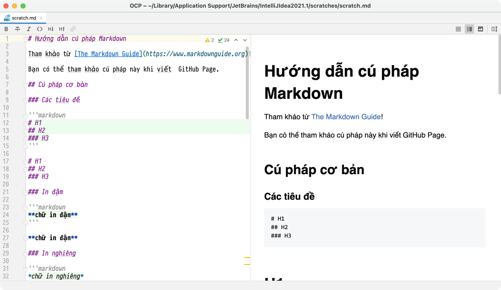

# Hướng dẫn cú pháp Markdown

Tham khảo từ [The Markdown Guide](https://www.markdownguide.org)!

Bạn có thể tham khảo cú pháp này khi viết  GitHub Page.

## Cú pháp cơ bản

These are the elements outlined in John Gruber’s original design document. All Markdown applications support these elements.

### Các tiêu đề

```markdown
# H1
## H2
### H3
```

# H1
## H2
### H3

### In đậm

```markdown
**chữ in đậm**
```

**chữ in đậm**

### In nghiêng

```markdown
*chữ in nghiêng*
```

*chữ in nghiêng*

### Blockquote

```markdown
> blockquote
```

> blockquote

### Danh sách có thứ tự

```markdown
1. First item
2. Second item
3. Third item
```

1. First item
2. Second item
3. Third item

### Danh sách không có thứ tự

```markdown
- First item
- Second item
- Third item
```

### Code

```markdown
`code`
```

`code`

### Dòng kẻ ngang

```markdown
---
```

---

### Link

```markdown
[title](https://www.example.com)
```

[title](https://www.example.com)

### Ảnh

```markdown

```


